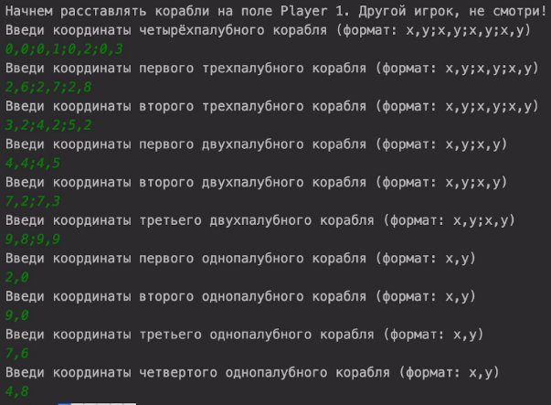
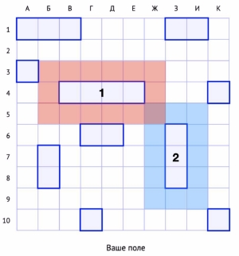
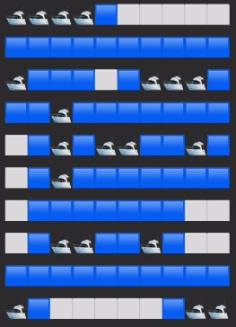

**Финальный проект "Морской бой"** 

Реализовать игру “Морской бой”. Игра должна быть рассчитана на игру двух людей на одном компьютере. Все взаимодействие между игроками и вашей программой должно происходить через консоль. 

Внимательно изучите правила игры перед тем, как начнете ее реализовывать: [https://ru.wikipedia.org/wiki/Морской_бой_(игра)](https://ru.wikipedia.org/wiki/%D0%9C%D0%BE%D1%80%D1%81%D0%BA%D0%BE%D0%B9_%D0%B1%D0%BE%D0%B9_\(%D0%B8%D0%B3%D1%80%D0%B0\)) 

Расстановка кораблей на поле: 

- В вашей программе должно создаваться два игровых поля (для первого и второго игрока). Игровое поле - это двумерный массив размером 10x10. 
- Сначала свои корабли расставляет первый игрок, затем их расставляет второй игрок. Когда первый игрок расставляет свои корабли, второй игрок должен отвернуться от компьютера. И наоборот, когда второй игрок расставляет свои корабли, первый игрок должен отвернуться от компьютера. 
- Корабль может быть расположен горизонтально или вертикально. 

**Пример корректного игрового поля (есть как горизонтальные, так и вертикальные корабли):** 

- Для того, чтобы расставить корабли, игрок последовательно вводит координаты всех 10 кораблей в консоль. Формат координат следующий: 

x1,y1;x2,y2;x3,y3;x4,y4 - для четырехпалубного корабля x1,y1;x2,y2;x3,y3 - для трехпалубных кораблей x1,y1;x2,y2 - для двухпалубных кораблей 

x1,y1 - для однопалубных кораблей 

То есть две координаты x и y, описывающие одну клетку на поле, разделяются запятой. А если корабль состоит из нескольких клеток (все корабли, кроме однопалубных), его координаты - это несколько координат x,y через точку с запятой (;). Пример расстановки кораблей показан на скриншоте: 

Во время расстановки кораблей вы должны проверять, что: 

1) Каждая из координат, введенных пользователем, корректна (корректные координаты - это два числа от 0 до 9, эти два числа разделены запятой). 
1) Количество координат правильное (для четырехпалубного корабля координат должно быть 4, для трехпалубного - 3, и так далее). 
1) Введенные координаты - это валидный корабль. Валидный корабль - это одна или несколько последовательно идущих клеток (по вертикали или горизонтали). То есть несколько координат, разбросанных по карте - это невалидный корабль. Вам нужно проверить это. 
1) Корабль размещается на свободном месте на карте. 
1) Размещаемый корабль не касается других кораблей сторонами и углами. То есть, вокруг каждого корабля должен быть “ореол” из одной клетки, на который не могут размещаться какие-либо другие корабли. 

Вокруг кораблей 1 и 2 показаны их ореолы. Ореол есть у каждого корабля и никакой другой новый корабль не может заходить на 

пространство ореола. 

Если введенные с консоли координаты не удовлетворяют хотя бы одному из вышеописанных условий, вы должны вывести в консоль сообщение об ошибке (сообщение об ошибке - разное для каждого из условий). После этого, вы должны повторно запросить координаты у пользователя. 

Например, если вы вводите координаты двухпалубного корабля и он попадает на ореол уже существующего на поле корабля, ваша программа должна вывести в консоль сообщение: “Вокруг корабля должна быть область шириной в одну клетку, в которой не может быть других кораблей (ореол корабля)” и запросить координаты с консоли еще раз до тех пор, пока не будут введены валидные координаты. 

После того, как оба игрока расставили корабли на своих полях, игра начинается. 

Правила ходов: 

1) Каждый ход - это введенные одним из игроков координаты x,y. Эти координаты обозначают ту ячейку, по которой хочет “ударить” игрок. 
1) Игрок, делающий первый ход должен выбираться случайно (используйте класс Random или метод Math.random()). 
1) Если текущий игрок попадает в пустое пространство поля соперника, в консоли должно появиться сообщение “Мимо!” и право следующего хода должно перейти сопернику. 
1) Если текущий игрок попадает в корабль соперника, в консоли должно появиться либо сообщение “Попадание!”, либо сообщение “Утопил!”, если это попадание ударило по последней ячейке корабля и утопило этот корабль. В любом случае (при попадании или утоплении) право следующего хода остается за текущим игроком. 
5) Выигрывает тот игрок, который первым утопил все корабли соперника. Как только победитель топит последний корабль соперника, игра прекращается. 

У игрового поля должен быть метод, который выводит это поле в консоль. 

Свободные ячейки изображайте с помощью символа ⬜: System.*out*.print("⬜"); 

Ячейки с кораблями изображайте с помощью символа 🛥 (код символа - \uD83D\uDEE5) 

Ореол кораблей изображайте с помощью символа    (код символа - \uD83D\uDFE6) 

Подбитую ячейку изображайте с помощью символа    (код символа - \uD83D\uDFE5) 

Сайт с эмодзи: [https://emojipedia.org](https://emojipedia.org/) 

**Пример вывода игрового поля в консоли (ваши эмодзи могут отличаться):** 

